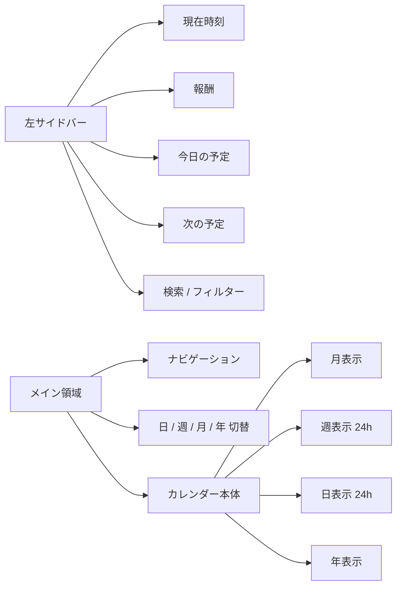
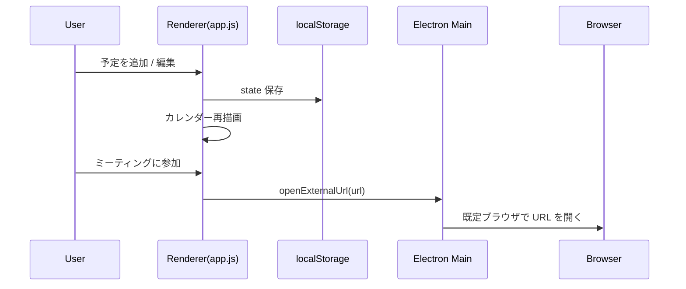
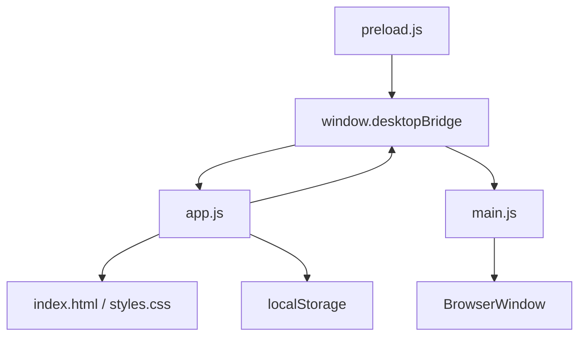
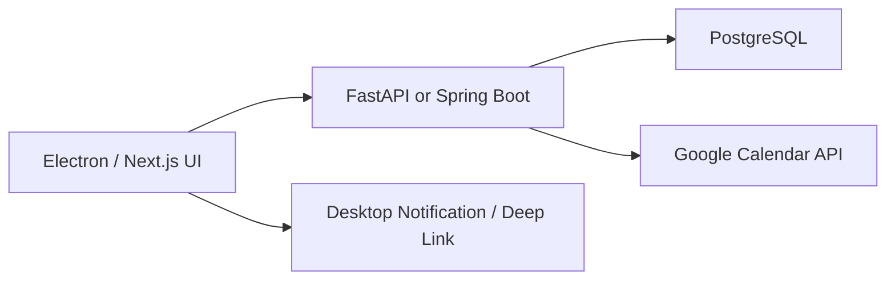

# Bloom Calendar

> Electron ベースの常時表示向けデスクトップカレンダー  
> 月表示中心で、予定管理・時間管理・会議 URL 管理・報酬計算までを 1 画面で扱う MVP

## Overview

Bloom Calendar は、PC 上で常時立ち上げて使うことを前提にしたカレンダーアプリです。  
Mac 標準カレンダーの月表示を参考にしつつ、よりポップで見やすい UI に寄せています。

### できること

- 月 / 週 / 日 / 年ビューの切り替え
- 予定の追加 / 編集 / 削除
- カテゴリごとの色分け
- 重要度ベースの予定カラー表示
- ミーティング URL 保存とワンクリック起動
- 今日の予定 / 次の予定 / 現在時刻の常時表示
- 過去の予定・時間帯・タイトル・場所の再利用
- 稼働時間の表示
- 報酬の月次自動計算

## Screenshot Mental Model



## Tech Stack

| Layer | Stack |
|---|---|
| Desktop shell | Electron |
| UI | HTML / CSS / Vanilla JavaScript |
| Storage | `localStorage` |
| External open | Electron `shell.openExternal` |
| Runtime | Node.js / npm |

## Directory Structure

```text
.
├─ index.html      # UI マークアップ
├─ styles.css      # 画面スタイル
├─ app.js          # レンダラー側の状態管理・描画・ロジック
├─ main.js         # Electron メインプロセス
├─ preload.js      # Renderer <-> Electron bridge
├─ package.json    # 起動スクリプト / 依存
└─ README.md
```

## Startup

### Requirements

- Node.js
- npm

### Install

```bash
npm install
```

### Run

```bash
npm start
```

## Main Features

### 1. Calendar Views

- `月表示`
  - 7 列カレンダー
  - 予定タイトルを日付セル内に表示
  - セル右上にその日の `◯時間稼働`
- `週表示`
  - 0:00-24:00 のタイムライン
  - 現在時刻ライン表示
- `日表示`
  - 1 日単位の 24 時間表示
  - 空き時間の可視化
- `年表示`
  - 12 か月の一覧表示

### 2. Event Management

- タイトル
- 開始 / 終了日時
- 終日予定
- カテゴリ
- 場所
- 備考
- ミーティング URL
- 通知
- 繰り返し
- 重要度
- 完了状態

### 3. Reuse / Input Assist

- 過去のタイトルを候補選択
- 過去の場所を候補選択
- 過去の時間帯を候補選択
- 過去の予定を丸ごとコピーして別日に流用

### 4. Meeting URL Management

- Google Meet / Zoom / Teams を簡易判定
- 詳細モーダルから `ミーティングに参加`
- Electron 経由で既定ブラウザを起動

### 5. Reward Calculation

左サイドバーで報酬を月合計表示します。  
報酬モードは 3 つあります。

- `① 時給`
  - `稼働時間 × 時給 × 1.1`
- `② 日給`
  - `稼働日数 × 日給 × 1.1`
- `③ 一案件単価`
  - `案件数 × 一案件単価`

現状の `案件数` は、表示中の月にある `予定タイトルのユニーク件数` で計算しています。

## UI Rules

### Weekend / Holiday Color

- 土曜日
  - 文字: 青
  - 背景 / 枠: パステルブルー
- 日曜日・日本の祝日
  - 文字: 赤
  - 背景 / 枠: パステルレッド

### Priority Color

| Priority | Color |
|---|---|
| 5 | 赤 |
| 4 | オレンジ |
| 3 | 青 |
| 2 | グリーン |
| 1 | グレー |

カテゴリ色は、予定カード全体ではなくドットや補助表示で残しています。

## Workload Logic

月セル右上の `◯時間稼働` と月次作業時間は、予定の合計時間から計算します。

### 平日休みルール

平日に以下の条件を満たす予定がある場合、その日の稼働時間は `0` 扱いになります。

- タイトルまたは備考に以下を含む
  - `休み`
  - `休暇`
  - `有休`
  - `代休`
  - `休日`
  - `off`
  - `pto`
  - `vacation`
- かつ、`終日予定` または `8時間以上`

## Data Flow



## State Model

主要な状態は `app.js` の `state` で管理しています。

```js
{
  view,
  currentDate,
  searchText,
  importantOnly,
  selectedCategoryIds,
  rewardMode,
  rewardRate,
  categories,
  events
}
```

### localStorage Key

```text
bloom-calendar-state-v1
```

## Electron Architecture



### Roles

- `main.js`
  - Electron ウィンドウ生成
  - `shell.openExternal` 実行
  - メニュー非表示
- `preload.js`
  - Renderer へ安全な API を公開
- `app.js`
  - 描画
  - 状態管理
  - フィルター
  - 稼働時間 / 報酬計算

## Current Limitations

- バックエンドなし
- データ保存は `localStorage` のみ
- 同期なし
- 認証なし
- 通知は UI 設計のみで、OS 通知は未実装
- 一案件単価の「案件」判定は暫定的

## Recommended Next Steps

### Near Term

- テンプレート機能の独立管理
- ドラッグ & ドロップで予定移動
- 完了済み / 未完了の専用一覧
- OS ネイティブ通知
- 設定画面の拡張

### Mid Term

- SQLite 永続化
- Electron packaging
- 自動起動 / 常駐
- CSV / Excel エクスポート

### Long Term

- Next.js + FastAPI + PostgreSQL への再構成
- Google Calendar 連携
- 複数端末同期
- スマホ連携

## Development Notes

### Useful Commands

```bash
npm install
npm start
node --check app.js
node --check main.js
node --check preload.js
```

### Notes About Electron Startup

この環境では `ELECTRON_RUN_AS_NODE=1` が入っていることがあるため、`package.json` の起動スクリプトではそれを外して Electron を通常モードで起動しています。

## Future Architecture Target

最終的には、以下のような構成に移行しやすいように考えています。



---

Bloom Calendar は、まずは「常時表示で実際に使えること」を優先した MVP です。  
いまの実装はシンプルですが、将来の本格構成へ移行しやすいように機能と責務を分けています。
